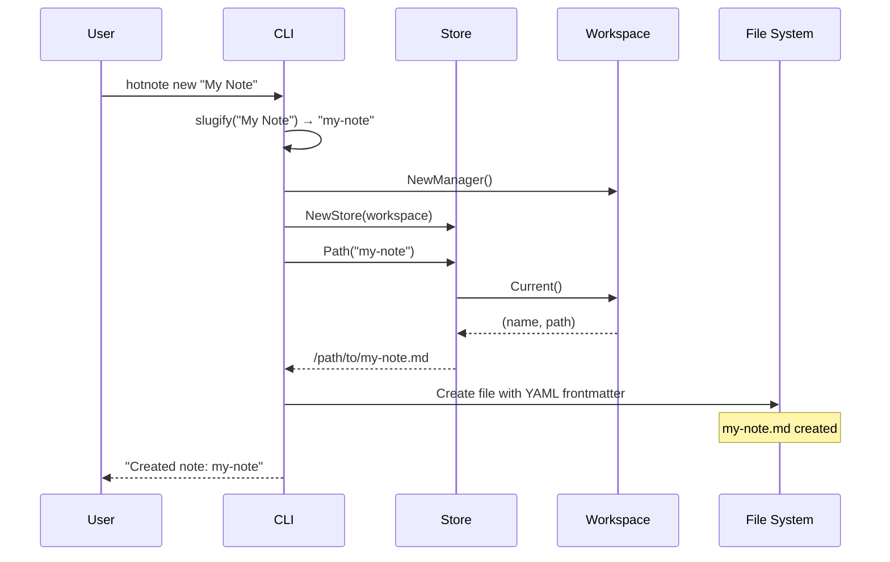
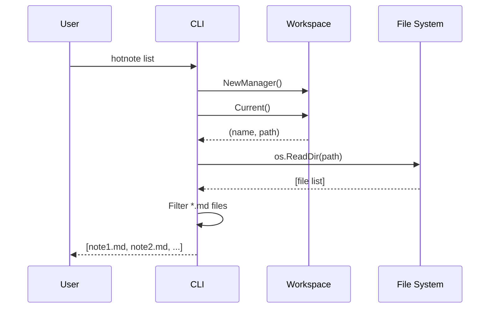
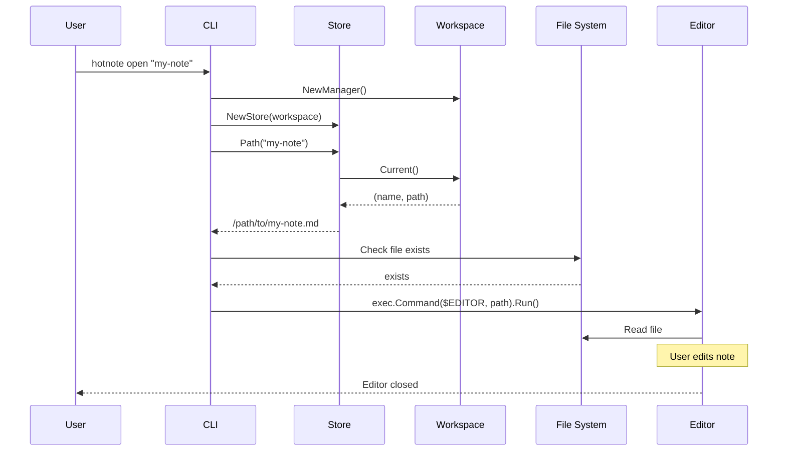
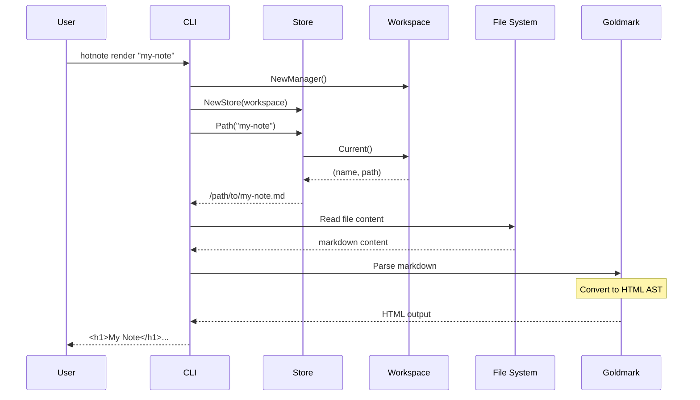
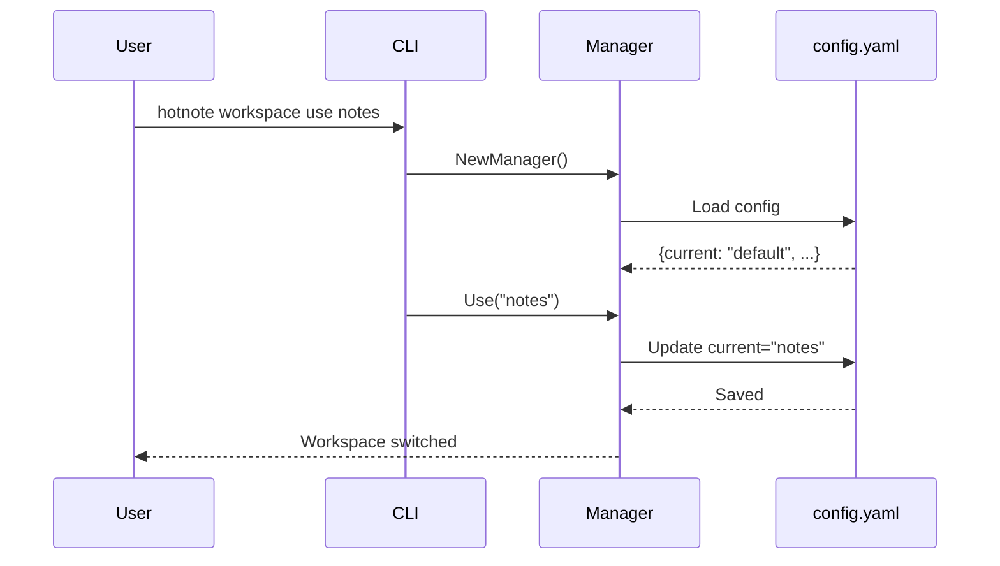

# Data Flow

This document traces how data moves through the system for each operation.

## Creating a Note



### Step-by-Step Details

1. **Slugify**: Convert title to URL-safe string
   ```go
   slug := slugify("My Note")  // "my-note"
   ```

2. **NewManager()**: Create workspace manager
   - Reads config from `~/.config/hotnote/config.yaml`
   - Returns `*Manager` instance

3. **NewStore(wm)**: Create storage with workspace dependency
   - Store holds reference to WorkspaceManager
   - Uses current workspace path for file operations

4. **Ensure()**: Create file if not exists
   - Uses `os.OpenFile` with `O_CREATE|O_EXCL` flags
   - Returns error if file already exists

5. **Write frontmatter**: YAML header with metadata
   ```yaml
   ---
   id: <uuid>
   title: My Note
   created_at: <RFC3339>
   updated_at: <RFC3339>
   tags: []
   ---
   ```

6. **Sync**: Flush to disk

## Listing Notes



## Opening a Note



## Rendering Markdown



### Step-by-Step Details

1. **Read file**: Load markdown content from workspace
2. **Parse**: Goldmark converts markdown to AST
3. **Render**: Output HTML to stdout

## Workspace Switching


