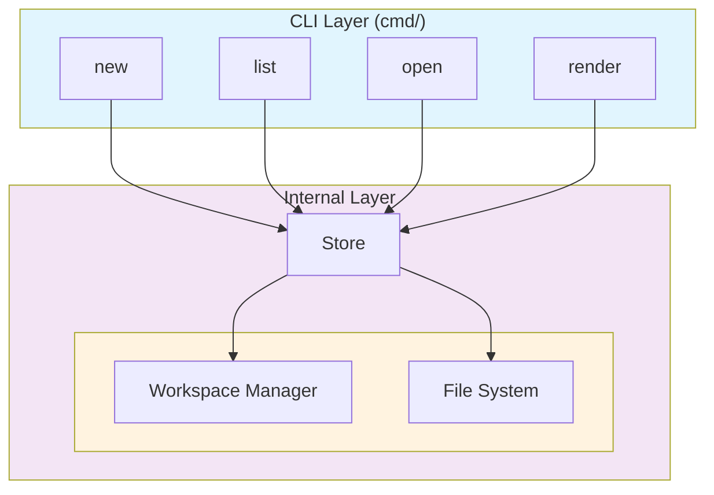

# Architecture Overview

## Project Structure

```
hotnote/
├── cmd/                        # Application entry points
│   ├── hotnote/
│   │   └── main.go             # Entry point (calls RootCmd.Execute())
│   ├── root.go                 # Root CLI command (Cobra)
│   ├── new.go                  # Create new note
│   ├── list.go                 # List notes
│   ├── open.go                 # Open note in editor
│   ├── render.go               # Render markdown to HTML
│   ├── workspace.go            # Workspace management commands
│   ├── ai.go                   # AI operations (stub)
│   ├── workspace_test.go       # Workspace CLI tests
│   ├── benchmark_test.go       # Performance benchmarks
│   ├── exitcodes_test.go       # Exit code tests
│   └── slugify_test.go        # Slugify tests
│
├── internal/                    # Private packages
│   ├── core/
│   │   └── models.go           # Domain models (Note, Workspace)
│   ├── storage/
│   │   ├── store.go            # Storage layer implementation
│   │   └── store_test.go       # Storage tests
│   ├── workspace/
│   │   ├── workspace.go        # Workspace manager
│   │   └── workspace_test.go   # Workspace tests
│   ├── errors/
│   │   └── errors.go           # Exit code constants
│   ├── fsutil/
│   │   ├── fsutil.go           # Atomic file operations
│   │   └── fsutil_test.go      # fsutil tests
│   ├── pathutil/
│   │   └── pathutil.go         # Path validation utilities
│   ├── ai/                     # AI integration (stub)
│   ├── markdown/               # Markdown processing (stub)
│   ├── search/                 # Search functionality (stub)
│   ├── tui/                    # Terminal UI (stub)
│   └── cli/                    # CLI utilities (stub)
│
├── .ai/                         # Design documents
├── docs/                        # Documentation
├── go.mod                       # Module definition
└── README.md
```

## Component Layers



## Key Components

### CLI Layer (`cmd/`)

Uses [Cobra](https://github.com/spf13/cobra) for command-line parsing. Each command is a separate file.

| Command | File | Purpose |
|---------|------|---------|
| `hotnote create` | `create.go` | Create a new note (alias: `new`) |
| `hotnote list` | `list.go` | List all notes (alias: `ls`) |
| `hotnote open` | `open.go` | Open note in `$EDITOR` (alias: `op`) |
| `hotnote render` | `render.go` | Render markdown to HTML (alias: `rdr`) |
| `hotnote delete` | `delete.go` | Delete a note (alias: `del`) |
| `hotnote rename` | `rename.go` | Rename a note (alias: `rn`) |
| `hotnote folder` | `folder.go` | Folder management |
| `hotnote folder create` | `folder_create.go` | Create folder (aliases: `new`, `cr`) |
| `hotnote folder delete` | `folder_delete.go` | Delete folder (alias: `del`) |
| `hotnote folder list` | `folder_list.go` | List folder contents (alias: `ls`) |
| `hotnote folder rename` | `folder.go` | Rename folder (alias: `rn`) |
| `hotnote workspace` | `workspace.go` | Manage workspaces |
| `hotnote workspace create` | `workspace.go` | Create workspace (alias: `new`) |
| `hotnote tui` | `tui.go` | Launch TUI |
| `hotnote ai` | `ai.go` | AI operations (stub) |

### Internal Layer (`internal/`)

Contains implementation details not exposed to external packages.

#### `internal/core/models.go`

Domain models representing core business entities:

```go
type Note struct {
    ID        string    // Unique identifier (slug)
    Title     string    // Human-readable title
    Path      string    // Full path to note file
    Tags      []string  // Optional tags
    CreatedAt time.Time // Creation timestamp
    UpdatedAt time.Time // Last modification
}

type Workspace struct {
    RootPath string // Workspace directory path
}
```

#### `internal/storage/store.go`

File-based storage implementation. Provides methods to create and locate note files.

```go
type Store struct {
    wm WorkspaceManager  // Depends on workspace manager
}
```

#### `internal/workspace/workspace.go`

Manages multiple note workspaces. Handles configuration persistence.

```go
type Manager struct {
    configPath string  // ~/.config/hotnote/config.yaml
    config     *Config
}

type Config struct {
    CurrentWorkspace string            `yaml:"current_workspace"`
    Workspaces       map[string]string `yaml:"workspaces"`
}
```

#### `internal/errors/errors.go`

Defines exit code constants for consistent error handling:

```go
const (
    ExitSuccess       = 0
    ExitGeneral       = 1
    ExitNotFound      = 2
    ExitInvalidInput  = 3
    ExitConfigError   = 4
)
```

#### `internal/fsutil/fsutil.go`

Provides atomic file operations for reliable writes:

```go
// AtomicWrite creates a temp file and renames it to target
func AtomicWrite(path string, data []byte, perm os.FileMode) error

// AtomicWriteExclusive creates a new file atomically (fails if exists)
func AtomicWriteExclusive(path string, data []byte, perm os.FileMode) error
```

## Dependencies

| Package | Purpose |
|---------|---------|
| `github.com/spf13/cobra` | CLI framework |
| `github.com/yuin/goldmark` | Markdown to HTML conversion |
| `github.com/google/uuid` | UUID generation |
| `gopkg.in/yaml.v3` | Configuration serialization |
| `github.com/stretchr/testify` | Testing assertions |

## Design Decisions

### Why Cobra?

Cobra provides:
- Declarative command structure
- Built-in help generation
- Flags and subcommand support
- Industry standard for Go CLIs

### Why File-Based Storage?

- Simple, portable (just copy `.md` files)
- Human-readable (markdown)
- No database dependencies
- Version-control friendly

### Why `internal/` Directory?

Go's `internal/` convention prevents external packages from importing private code:

> "The go build command refuses to import a package that is inside `$GOPATH/src/.../internal/`"

This enforces clean architectural boundaries.
